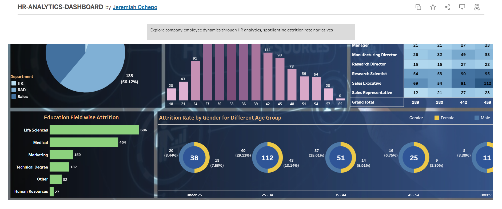

# HR Analytics Dashboard Project

## Overview

The **HR Analytics Dashboard Project** is an interactive data visualization tool built to help organizations gain actionable insights into their workforce. Using Tableau, the dashboard analyzes key HR metrics such as employee turnover, recruitment efficiency, workforce demographics, and performance trends. This project highlights my ability to transform raw data into meaningful solutions that support strategic decision-making and operational excellence.

The project is designed to empower HR teams with a clear understanding of workforce trends and to facilitate data-driven policies for recruitment, retention, and organizational growth.

---

## Key Features

### 1. **Employee Turnover Analysis**
- **Functionality:**  
  Displays turnover rates by department, tenure, and demographic factors.
- **Significance:**  
  Helps organizations identify areas of high attrition and implement targeted retention strategies.

### 2. **Recruitment Metrics**
- **Functionality:**  
  Tracks metrics such as time-to-hire, candidate conversion rates, and hiring trends.
- **Significance:**  
  Streamlines recruitment processes and highlights inefficiencies for optimization.

### 3. **Workforce Demographics**
- **Functionality:**  
  Provides insights into age, gender, and tenure distributions within the workforce.
- **Significance:**  
  Supports diversity, equity, and inclusion (DEI) initiatives and workforce planning.

### 4. **Performance and Satisfaction Insights**
- **Functionality:**  
  Correlates employee performance ratings with satisfaction and engagement levels.
- **Significance:**  
  Guides organizations in designing effective incentive programs and improving morale.

---

## Tools and Technologies

- **Tableau:** For creating interactive dashboards and visualizations.
- **Excel:** For initial data cleaning and preprocessing.
- **Statistical Methods:** To uncover trends and actionable insights in HR data.

---

## Project Objectives

- Deliver a comprehensive overview of workforce dynamics to HR professionals.
- Highlight trends and patterns in recruitment, retention, and employee satisfaction.
- Provide actionable insights to drive better workforce management and strategic planning.

---

## Insights Derived

1. **Turnover Trends:** Identified departments with high attrition rates and the underlying causes.
2. **Recruitment Efficiency:** Highlighted bottlenecks in the hiring process and proposed improvements.
3. **Diversity Metrics:** Uncovered disparities in workforce demographics, driving DEI-focused initiatives.
4. **Performance-Satisfaction Correlation:** Found key drivers of employee satisfaction linked to productivity and retention.

---

## Screenshots

### 1. **Dashboard Overview**

---

## Usage Instructions

1. **Access the Dashboard:**  
   Visit the interactive dashboard to explore workforce metrics in real-time.

2. **Navigate Metrics:**  
   Utilize the filters and visualizations to identify trends and insights.

3. **Implement Recommendations:**  
   Leverage the data-driven insights to improve workforce strategies.

---

## Link to the Project

Explore the full interactive dashboard: [HR Analytics Dashboard](https://public.tableau.com/app/profile/jeremiah.ochepo/viz/HR-ANALYTICS-DASHBOARD_17023441100110/HRANALYTICSSTORY)

---

## Relevance to My Work

This project showcases my ability to design, implement, and interpret data visualization solutions. It directly supports my broader initiatives, such as my proposed AI-driven homelessness prevention system, by demonstrating expertise in analyzing large datasets and deriving impactful insights.

---

## Contact Information

For further inquiries or collaboration opportunities, please contact me:

- **Name:** Jeremiah Ochepo  
- **Email:** [jochepo4growth@gmail.com](mailto:jochepo4growth@gmail.com)  

---

## License

This project is open-source and available under the [MIT License](LICENSE). Feel free to explore, adapt, and build upon this work.